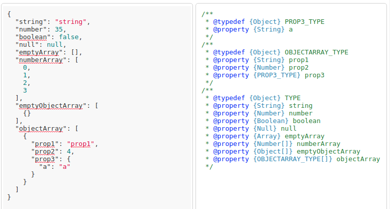
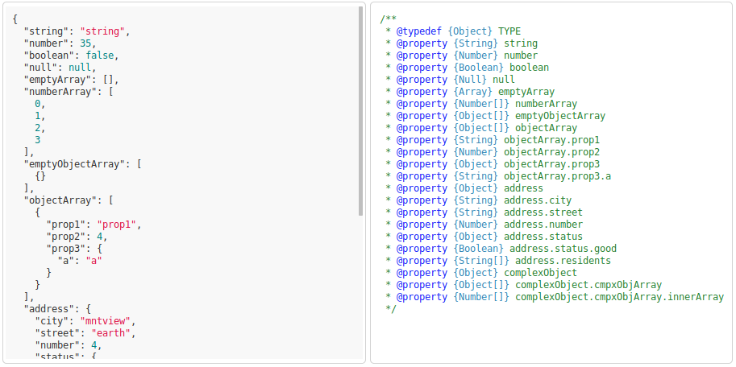

# Recursive JSDoc type generator 

Generates JSDoc types from JSON. Can generate JSDoc with splitted types or plain.
## [DEMO](https://iozheg.github.io/)



## Getting Started

If you want just generator than import 'json2jsdoc' function from json2JSDocParser.js and provide it with correct JS object or array or primitive.

### Installing

Just clone project, install dependencies

```
npm install
```

than run

```
npm run start
```

## Running the tests
Run tests once:
```
npm run test
```
Run continuously:
```
npm run test:c
```

### Unit tests

Unit tests cover only type generation. It's supposed that correct JSON provided to type generator.
Test JSONs has some complex examples but there can be uncovered cases. See test fileы and mocks.js for examples.

## Deployment

Just now it isn't ready for deploying. :(

## Built With

* [highlight.js](https://highlightjs.org/) - highlighting input JSON

## Contributing

Just make PRs or something like that :)

## Versioning

SemVer.

## Authors

Aleksandr Netsev

## License

This project is licensed under the MIT License - see the [LICENSE.md](LICENSE.md) file for details
